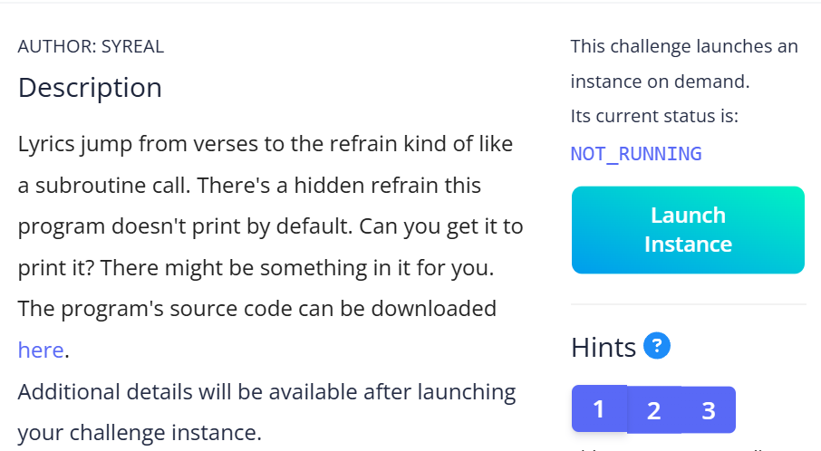

# Flag Hunters Write-up
  

## TL;DR
`song_lines[lip].split(';')` is used on attacker-controlled input without validation, allowing malformed or extra `;` tokens to cause IndexError (DoS), logic bypass, or downstream injection when tokens are consumed unsafely.

---

## Metadata
- **Author (Challenge):** syreal
- **Author (This Write-up):** Phong004 (phong.nguyenhoang2004@gmail.com)
- **Date:** 2025-11-09
- **Source:** [picoctf.org](https://play.picoctf.org/practice/challenge/472)
- **Category:** Reverse Engineering, Vulnerability
- **File:** [lyric-reader.py](https://challenge-files.picoctf.net/c_verbal_sleep/f9515a5a3a8eda47118d8907e6f91bc4cd5b0159b4a2f1fb2e17dbf4872f6011/lyric-reader.py)

---

## Environment & Tools
- Python 3.11
- Tools: `netcat/ncat`, `python`, `Visual Studio`

---

## Description
Lyrics jump from verses to the refrain kind of like a subroutine call. There's a hidden refrain this program doesn't print by default. Can you get it to print it? There might be something in it for you.
The program's source code can be downloaded [here](https://challenge-files.picoctf.net/c_verbal_sleep/f9515a5a3a8eda47118d8907e6f91bc4cd5b0159b4a2f1fb2e17dbf4872f6011/lyric-reader.py).
Additional details will be available after launching your challenge instance.



---

## Solution
- Psuedocode:
```Python
flag = "Flag{FakeFlag}"
secret_intro = "Pico war...conquer, " + flag + '\n' # The flag in secret_intro 
song_flag_hunters = secret_intro + "[REFRAIN]...END;" # We need to read secret_intro in song_flag_hunters

def reader(song=song_flag_hunters, startLabel='[VERSE1]'):
    # Innitialization:
    lip: line pointer
    start: index of the line immediately after the '[VERSE1]' line
    refrain: index of the first line immediately after of the 'REFRAIN' line
    refrain_return: index of the 'RETURN' line
    finished: the function exit when it's true

    # Split the song lines to a list song_lines
    # Find startLabel, refrain and refrain return
    for line in song_lines:
        if line == '[VERSE1]':
            start = cur_index + 1 # Set start to the index of the line immediately following startLabel
        elif line == '[REFRAIN]':
            refrain = cur_index + 1 # Set refrain to the index of the line after of the '[REFRAIN]' line
        elif line == 'RETURN':
            refrain_return = cur_index # Set refrain_return to the index of the 'RETURN' line

    # Print lyrics
    while not finished and number of line < MAX_LINES:
        line_count++

        # Spilt the current lyric line on ';' and iterate over each line (skip empty lines) (1)
        for line in song_lines[lip].split(';'):
            if line == '' and song_lines[lip] != '':
                continue

        # If line pointer (lip) points to 'REFRAIN' line, store the index of the line after of the '[REFRAIN]' line to the 'RETURN' line (2)
        if line == 'REFRAIN':
            song_lines[refrain_return] = 'RETURN ' + str(lip + 1)
            lip = refrain # Move pointer to 'REFRAIN' line
        
        # If line contains "CROWD.", get a unvalidated user-input. (3)
        # This is our entry to read the flag. 
        elif re.match(r"CROWD.*", line):
            crowd = input('Crowd: ')
            song_lines[lip] = 'Crowd: ' + crowd # Store the user-input string to line 'Crowd: ' (4) 
            lip += 1 # Move the pointer to the line after.
        
        # If line contains "RETURN [digit]+", move the pointer to index [digit] (5)
        elif re.match(r"RETURN [0-9]+", line):
            lip = int(line.split()[1])
```
- Analysis — summary of program flow:

1. The program hides the flag in a block `secret_intro` that is appended to first of the lyric lines; all lines are kept in `song_flag_hunters`. To recover the flag we must cause the player to read all lines in that collection.

2. The program uses markers such as `[VERSE1]`, `[REFRAIN]`, and `RETURN` to identify sections and control playback.

3. The program accepts unvalidated user input at `Crowd: ` and writes that input directly into the song lines.

4. During playback the code splits each lyric line on `;` and processes each token. When the `REFRAIN` token is encountered the program writes a `RETURN N` instruction into the `RETURN` slot and then jumps to the refrain start; later the `RETURN N` token causes the player to set its line pointer to N.

<b>Exploit idea (concise):</b> because tokens are produced by naive split(`;`) and then acted on without validation, an attacker-controlled string containing `; RETURN 0` (or similar) will create a `RETURN N` token. If we can inject `;RETURN 0` (for example via the Crowd: input), the parser will interpret it as a control instruction and set the playback pointer to line 0 — allowing the player to reprint earlier lines (including the hidden `secret_intro`) and thus reveal the flag.

<b>Conditions & risks:</b> this attack requires that the attacker can inject a semicolon-delimited token into a line that the player will later process (e.g., through CROWD input). There is no bounds checking on `RETURN N`, no sanitization of Crowd input, and control tokens are embedded as plain text, so this path enables logic manipulation, information disclosure.
